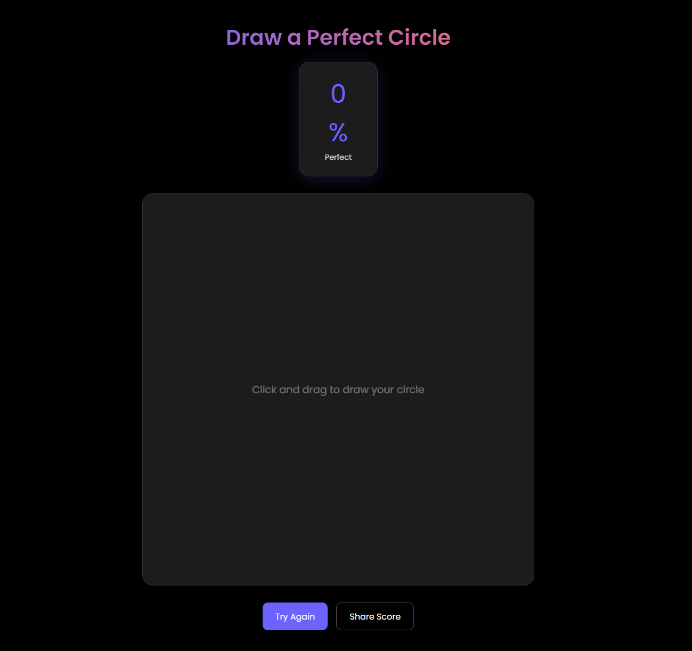

# 🎯 Perfect Circle Challenge

<div align="center">
  
  
  
</div>

<p align="center">A sleek web-based game challenging users to draw the perfect circle. Test your steady hand and geometric precision in real-time! 🎨</p>

## 📑 Table of Contents
- [🎯 Perfect Circle Challenge](#-perfect-circle-challenge)
  - [📑 Table of Contents](#-table-of-contents)
  - [✨ Features](#-features)
  - [🚀 Demo](#-demo)
  - [🛠️ Installation](#️-installation)
  - [💻 Usage](#-usage)
  - [🎮 How to Play](#-how-to-play)
  - [🎨 Technologies Used](#-technologies-used)
  - [🤝 Contributing](#-contributing)
  - [📝 License](#-license)

## ✨ Features
- 🔄 Real-time circle perfection calculation
- 📱 Responsive design for all devices
- 🌓 Dark mode interface
- 🎯 Visual guidance system
- 📊 Instant feedback scoring
- 📲 Touch screen support
- 📤 Share functionality

## 🚀 Demo
Try the live demo [](#)

## 🛠️ Installation
1. Clone the repository:
```bash
git clone https://github.com/sfeirc/perfect-circle-challenge.git
```

2. Navigate to the project directory:
```bash
cd perfect-circle-challenge
```

3. Open `index.html` in your browser or use a local server.

## 💻 Usage
Simply open the `index.html` file in a modern web browser. No additional setup or dependencies required!

## 🎮 How to Play
1. 🖱️ Click and hold (or touch on mobile)
2. 🎨 Draw your circle in one continuous motion
3. 📊 Watch your perfection score update in real-time
4. 🔄 Release to see your final score
5. 📤 Share your results or try again!

## 🎨 Technologies Used
- HTML5 Canvas for drawing functionality
- CSS3 for modern styling and animations
- Vanilla JavaScript for game logic
- Responsive design principles
- Touch events API

## 🤝 Contributing
Contributions are welcome! Here's how you can help:

1. 🍴 Fork the repository
2. 🌿 Create a new branch (`git checkout -b feature/improvement`)
3. 🔧 Make your changes
4. ✅ Commit your changes (`git commit -am 'Add new feature'`)
5. 📤 Push to the branch (`git push origin feature/improvement`)
6. 🔄 Create a Pull Request

## 📝 License
This project is licensed under the MIT License - see the [LICENSE](LICENSE) file for details.

---

<div align="center">
  <p>Made with ❤️ by Clovis </p>
  <p>⭐ Star this repository if you found it helpful!</p>
</div>
```
